# Battleship Game

Battleship game is a website that allows users to play game against computer. Both players will try to guess the location of ships.  The location of the ships is unknown and it is generated randomly on player board and computer board. If the player missed the location the player gets an alert message "You missed" and the location gets assigned "x". If the player hits the battleship the player gets an alert message "you hit one" and the location gets assigned "#". If the computer missed the location the player gets an alert message "computer missed" and the location gets assigned "O". If the computer hits the battleship the player gets an alert message "computer hits ship" and the location gets assigned "#". 
[View the live site here](https://battleships-app-3b11e752263f.herokuapp.com/).

  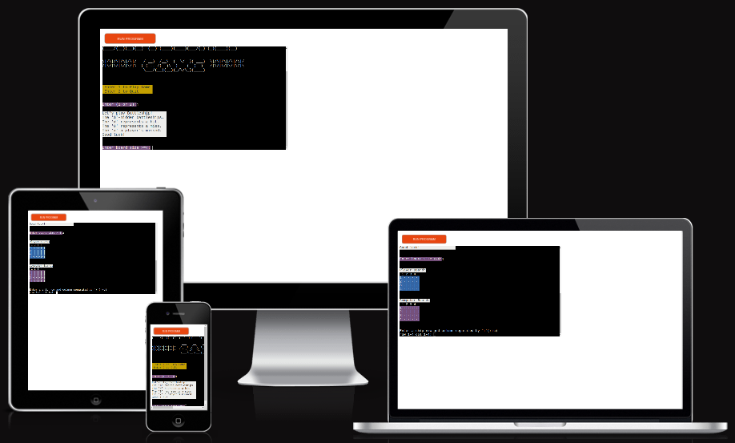

## Game Features

### Game Introductory page

* Heading
  * A heading is the name of the game and is displayed at the top of the page. It gives the user an overview about the game.

  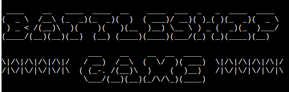

* Play / Quit Option
  * On the home page the user is provided with two option that is to play or to quit. Once the user selects "1" and press enter then the user will be prompted to the game.

  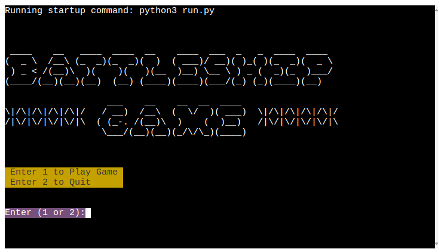  

### Game main page

* The Game Area
  * The player will get to read the key information about the board and the symbols used in the game board with their meaning and representation.

  * Here the player will be able to select the board size and start playing. The player has to enter his board size in order to play.

  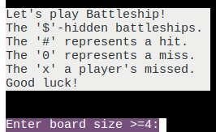

* Game Board
  * The game board is where the player guesses the battle ship locations. The game board will include different type of information about the game. 
    * A  4x4 game board

      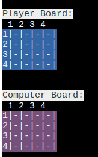
    * A 5x5 game board

        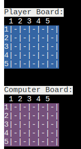 

* A hit / A miss
  * Every time the player makes a guess the player will get back the result of the location entered. 
  * If the player guessed the correct location, will get a hit notification. If the player guess is wrong, will get a miss notification. 

    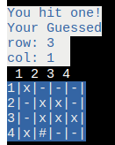
    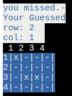

  * The player will also get information about the computer result.

    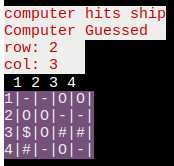
    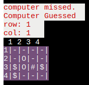

* Game Score
  * The game ends when one of the players reaches the maximum score. When a player hits a battleship score will get 1 point incremented.

   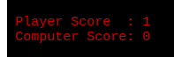

* Game Over Messages
  * At the end of the game a pop up message will be generated if all the battleship hit by the player or the computer.
  * This message will identify the winner.
  * Player wins

    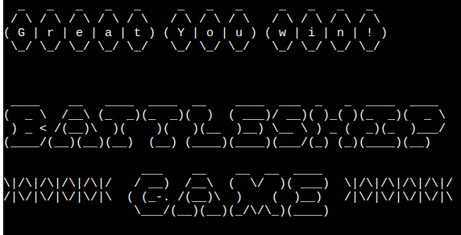

  * Computer wins

    

  * Game Draw

    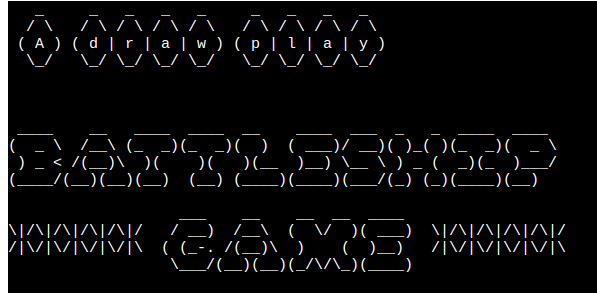

### Game Data Model

 * The class Definition is 'BattleShipGame' and it represents the Battleship game between two players and contains different methods to implement game logic. It has attributes such as size, player_score, com_score, Hidden_Bord, Hidden_Pattern_Comp, Player_Bord, Guess_Pattern_Comp, player_guessed_locations, and computer_guessed_locations to store the game state.

 * The different type of class methods handle tasks such as inputting the board size, printing players game board, validating players input, generating unique ship coordinates, creating random ships on the board, counting ship hits, checking game over conditions, generating for computer guess, playing the game, and displaying the home page.

 * The game_home_page method displays the introductory page of the game and allows the user to enter an option to play the game or quit. Based on the player's selected choice, the player starts a new game or quits the program. 
 
 * The play method allows the players to start the Battleship game, create initial state of the game board and hidden ship positions, both player and computer to make guesses and update the game state, prints the game boards and record scores after each guess, checks for game over state and displays the current state of game over message. The __main__ block creates an instance of the BattleShipGame class and calls the game_home_page method to initialize the game.

### Remaining future functionalities

* Allowing player to select row size, column size, and the number of battle ship.
* Game score storage. To store the number of wins made by the player and computer.
* Generating random ships for every trial of the game and allowing the player to guess infinitely and at any location until the maximum score is obtained.

### Design Flow Chart

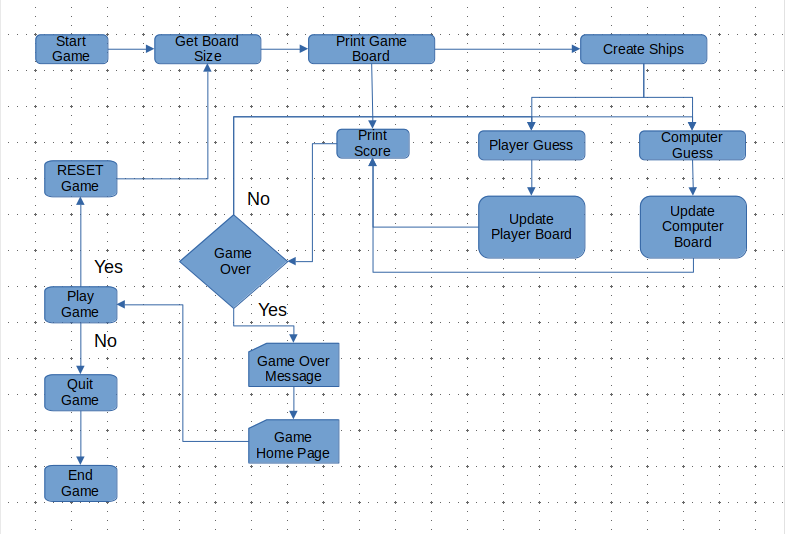

### Technologies

* Python - Python is the programming language applied design this application.

### Testing

Below are some of the testing features

* I f the board size is not entered correctly or left blank the the following error message will pop up.

    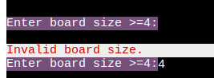

* Repeating the guessed location will give the following error message.

    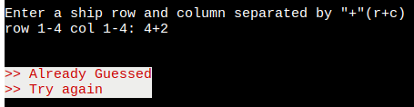

* Entering an invalid row or column location is not accepted and it will get a error notification.

    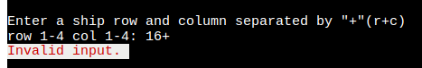

### PEP8 Validation

The python code was uploaded to the CI Python Linter to validate the code and was modified based on warnings and errors displayed. Result obtained shows "All clear, no errors found".

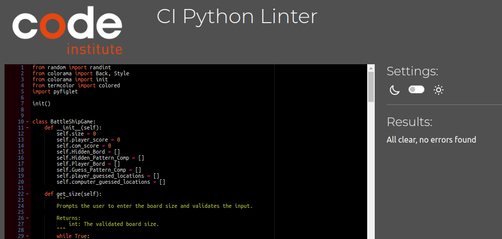

## Bugs and Fixes

Boards with the same randomly generated battleship was obtained that was because a single list of random generated battle ship was used. A second list was used to fix the duplicate board with the same battleship not be generated.

Guessing the battleship location was not unique it was possible to guess a ship location again. To fix this issue a list was created to append previously guessed locations and every time a new location is entered first it cross check with the previously guessed locations for its validation.

## Deployment

### Repository

The website was developed using the Visual Studio code editor and uploaded to the remote repository named 'battleship-game' on GitHub.

During the development process, the following Git commands were utilized to push the code to the remote repository:

1. `git add [file]` command was utilized to include the file(s) in the staging area prior to committing them.
2. `git commit -m [commit message]` command was employed to record and save the changes made to the local repository, preparing them for the final step.
3. `git push` command was utilized to upload all committed code to the remote repository on GitHub.

### Hosting on Heroku

* The website was successfully published on Heroku applications. The deployment process involved the following steps:
  * Open Heroku website and click "New" to create a new app.
  * Create an app name and region region, click "Create app".
  * Click "Settings" and click Config Vars. Add the following config variables:
    * KEY: PORT
    * VALUE: 8000
  * Select Buildpacks and add buildpacks for Python and NodeJS (in that order).
  * Click to "Deploy". Select the deployment type to Github and enter repository name and connect.
  * At the bottom of the page go to Manual Deploy, select "main" branch and select "Deploy Branch".
  * Once completed successfully, after waiting for some time the app will be deployed to heroku. 
  
  ### Clone the repository code locally

To create a local copy of the repository code by cloning it just do the following steos:

  * Navigate to the GitHub Repository that you want to clone locally, and then click on the dropdown button labeled "Code".
  * Click on "HTTPS" and copy the link
  * Open your IDE and install git
  * On your cmd line write git clone "your https link"

## Credits

* The Battleship detailed information on [Wikipedia](https://en.wikipedia.org/wiki/Battleship_(game)).

* Print Colors in Python terminal and Python | ASCII art using pyfiglet module [Geegforgeeks](https://www.geeksforgeeks.org/).

* Code institute Mentor Gareth McGirr.

* Code Institute for Heroku deployment tutorials.

